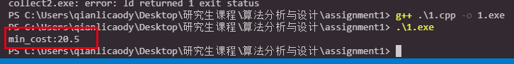
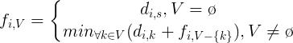
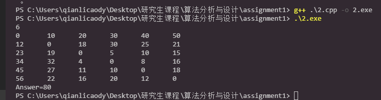

<center><font face="宋体" size=10>算法分析与设计第二次作业</font></center>

**<center>石发强_ZY1806707</center>**  

- [1. 第一题](#1-%E7%AC%AC%E4%B8%80%E9%A2%98)
  - [1.1. 相关的变量与状态转移方程、递推关系](#11-%E7%9B%B8%E5%85%B3%E7%9A%84%E5%8F%98%E9%87%8F%E4%B8%8E%E7%8A%B6%E6%80%81%E8%BD%AC%E7%A7%BB%E6%96%B9%E7%A8%8B%E9%80%92%E6%8E%A8%E5%85%B3%E7%B3%BB)
  - [1.2. 详细的计算步骤](#12-%E8%AF%A6%E7%BB%86%E7%9A%84%E8%AE%A1%E7%AE%97%E6%AD%A5%E9%AA%A4)
    - [1.2.1. k=4](#121-k4)
    - [1.2.2. k=3](#122-k3)
    - [1.2.3. k=2](#123-k2)
    - [1.2.4. k=1](#124-k1)
    - [1.2.5. 决策路径回溯](#125-%E5%86%B3%E7%AD%96%E8%B7%AF%E5%BE%84%E5%9B%9E%E6%BA%AF)
  - [1.3. 代码实现](#13-%E4%BB%A3%E7%A0%81%E5%AE%9E%E7%8E%B0)
    - [1.3.1. 源代码](#131-%E6%BA%90%E4%BB%A3%E7%A0%81)
    - [1.3.2. 代码运行结果截图](#132-%E4%BB%A3%E7%A0%81%E8%BF%90%E8%A1%8C%E7%BB%93%E6%9E%9C%E6%88%AA%E5%9B%BE)
    - [1.3.3. 附件](#133-%E9%99%84%E4%BB%B6)
- [2. 第二题](#2-%E7%AC%AC%E4%BA%8C%E9%A2%98)
  - [2.1. 递推关系式](#21-%E9%80%92%E6%8E%A8%E5%85%B3%E7%B3%BB%E5%BC%8F)
  - [2.2. 伪代码](#22-%E4%BC%AA%E4%BB%A3%E7%A0%81)
  - [2.3. 程序说明](#23-%E7%A8%8B%E5%BA%8F%E8%AF%B4%E6%98%8E)
    - [2.3.1. 源代码](#231-%E6%BA%90%E4%BB%A3%E7%A0%81)
    - [2.3.2. 运行结果](#232-%E8%BF%90%E8%A1%8C%E7%BB%93%E6%9E%9C)
  - [2.4. 时间复杂度](#24-%E6%97%B6%E9%97%B4%E5%A4%8D%E6%9D%82%E5%BA%A6)
  - [2.5. 附件](#25-%E9%99%84%E4%BB%B6)

# 1. 第一题

## 1.1. 相关的变量与状态转移方程、递推关系
- $n_k=\{2,3,2,4\},k=1,2,3,4$，表示第k个月的需求量，为题目所给信息
- $x_k$，转态变量，表示第K个月的月初库存量，则有约束条件
  $$\left\{\begin{matrix}
    x_1=x_5=0\\ 
    0 \le x_k \le \sum_{i=k}^{4}{n_i}
    \end{matrix}\right.$$
- $u_k$，决策变量，表示每个月的计划生产量，有约束条件
  $$max\{0,n_k-x_k\} \le u_k \le min\{6,\sum_{i=k}^{4}{n_i}-x_k\}$$
  即每个月的产量下限是0和$n_k-x_k$中的较大值，至少要满足当月的需求，在库存足够的情况下可以不生产；而产量上限是6和$\sum_{k=1}^{4}{n_k-x_k}$的较小值，也就是说既不可能超过实际的最大产能，也不能超过所有的需求总和。
- 由状态变量和决策变量可以确定状态转移方程为$x_{k+1}=u_k+x_k-n_k$，即下月初的库存量应该是本月初的库存与本月的生产量之和减去本月的需求量。
- 则第k个月的生产成本为
  $$v_k=\left\{\begin{matrix}
    0.5*(x_k-n_k),u_k=0 \\
    3+u_k+0.5*(u_k+x_k-n_k),u_k \neq 0
    \end{matrix}\right.$$
- 最后我们可以用$f_k(x_k)$表示第k个月初库存为x_k时到第4月结束这段时间的最优成本，则
  $$f_k(x_k)=min(v_k+f_{k+1}(x_{k+1}))=\left\{\begin{matrix}
    min(0.5*(x_k-n_k)+f_{k+1}(x_{k+1})),u_k=0 \\
    min(3+u_k+0.5*(u_k+x_k-n_k)+f_{k+1}(x_{k+1})),u_k \neq  0
    \end{matrix}\right.$$
  这样总的最优成本即为$f_1(x_1)=f_1(0)$

## 1.2. 详细的计算步骤
### 1.2.1. k=4
此时有约束条件$0 \le x_4 \le 4, max(0,4-x_4) \le u_4 \le min(6,4-x_4)$且$n_4=4$，则
| $x_4$ | $u_4$ | $x_5$ | $v_5$ | $f_5(x_5)$ | $v_4+f_5(x_5)$ | 决策路径 |
|:-----:|:--:|:--:|:--:|:----------:|:---------:|:--------:|
|   0   |  4 |  0 |  7 |      0     |     7     |  $f_4(0)$  |
|   1   |  3 |  0 |  6 |      0     |     6     |  $f_4(1)$  |
|   2   |  2 |  0 |  5 |      0     |     5     |  $f_4(2)$  |
|   3   |  1 |  0 |  4 |      0     |     4     |  $f_4(3)$  |
|   4   |  0 |  0 |  0 |      0     |     0     |  <font color="FF0000">$f_4(4)$</font>  |
此时对于状态$x_4$的每个取值，都有唯一确定的决策变量$u_4$使得$f_4(x_4)$最优。
### 1.2.2. k=3
此时有约束条件$0 \le x_3 \le 6, max(0,2-x_3) \le u_3 \le min(6,6-x_3)$且$n_3=2$，则
| $x_3$ | $u_3$ | $x_4$ | $v_3$ | $f_4(x_4)$ | $v_3+f_4(x_4)$ | 决策路径 |
|-------|-------|-------|-------|------------|----------------|----------|
| 0     | 2     | 0     | 5     | 7          | 12             |          |
|       | 3     | 1     | 6.5   | 6          | 12.5           |          |
|       | 4     | 2     | 8     | 5          | 13             |          |
|       | 5     | 3     | 9.5   | 4          | 13.5           |          |
|       | 6     | 4     | 11    | 0          | 11             |<font color="FF0000">$f_3(0)$</font> |
| 1     | 1     | 0     | 4     | 7          | 11             |          |
|       | 2     | 1     | 5.5   | 6          | 11.5           |          |
|       | 3     | 2     | 7     | 5          | 12             |          |
|       | 4     | 3     | 8.5   | 4          | 12.5           |          |
|       | 5     | 4     | 10    | 0          | 10             | $f_3(1)$ |
| 2     | 0     | 0     | 0     | 7          | 7              | $f_3(2)$ |
|       | 1     | 1     | 4.5   | 6          | 10.5           |          |
|       | 2     | 2     | 6     | 5          | 11             |          |
|       | 3     | 3     | 7.5   | 4          | 11.5           |          |
|       | 4     | 4     | 9     | 0          | 9              |          |
| 3     | 0     | 1     | 0.5   | 6          | 6.5            | $f_3(3)$ |
|       | 1     | 2     | 5     | 5          | 10             |          |
|       | 2     | 3     | 6.5   | 4          | 10.5           |          |
|       | 3     | 4     | 8     | 0          | 8              |          |
| 4     | 0     | 2     | 1     | 5          | 6              | $f_3(4)$ |
|       | 1     | 3     | 5.5   | 4          | 9.5            |          |
|       | 2     | 4     | 7     | 0          | 7              |          |
| 5     | 0     | 3     | 1.5   | 4          | 5.5            | $f_3(5)$ |
|       | 1     | 4     | 6     | 0          | 6              |          |
| 6     | 0     | 4     | 3     | 0          | 3              | $f_3(6)$ |
### 1.2.3. k=2
此时有约束条件$0 \le x_2 \le 9, max(0,3-x_2) \le u_2 \le min(6,9-x_2)$且$n_2=3$，则
| $x_2$ | $u_2$ | $x_3$ | $v_2$ | $f_3(x_3)$ | $v_2+f_3(x_3)$ | 决策路径 |
|-------|-------|-------|-------|------------|----------------|----------|
| 0     | 3     | 0     | 6     | 11         | 17             |          |
|       | 4     | 1     | 7.5   | 10         | 17.5           |          |
|       | 5     | 2     | 9     | 7          | 16             | $f_2(0)$ |
|       | 6     | 3     | 10.5  | 6.5        | 17             |          |
| 1     | 2     | 0     | 5     | 11         | 16             |          |
|       | 3     | 1     | 6.5   | 10         | 16.5           |          |
|       | 4     | 2     | 8     | 7          | 15             | $f_2(1)$ |
|       | 5     | 3     | 9.5   | 6.5        | 16             |          |
|       | 6     | 4     | 11    | 6          | 17             |          |
| 2     | 1     | 0     | 4     | 11         | 15             |          |
|       | 2     | 1     | 5.5   | 10         | 15.5           |          |
|       | 3     | 2     | 7     | 7          | 14             | $f_2(2)$ |
|       | 4     | 3     | 8.5   | 6.5        | 15             |          |
|       | 5     | 4     | 10    | 6          | 16             |          |
|       | 6     | 5     | 11.5  | 5.5        | 17             |          |
| 3     | 0     | 0     | 0     | 11         | 11             | <font color="FF0000">$f_2(3)$</font> |
|       | 1     | 1     | 4.5   | 10         | 14.5           |          |
|       | 2     | 2     | 6     | 7          | 13             |          |
|       | 3     | 3     | 7.5   | 6.5        | 14             |          |
|       | 4     | 4     | 9     | 6          | 15             |          |
|       | 5     | 5     | 10.5  | 5.5        | 16             |          |
|       | 6     | 6     | 12    | 3          | 15             |          |
| 4     | 0     | 1     | 0.5   | 10         | 10.5           | $f_2(4)$ |
|       | 1     | 2     | 5     | 7          | 12             |          |
|       | 2     | 3     | 6.5   | 6.5        | 13             |          |
|       | 3     | 4     | 8     | 6          | 14             |          |
|       | 4     | 5     | 9.5   | 5.5        | 15             |          |
|       | 5     | 6     | 11    | 3          | 14             |          |
| 5     | 0     | 2     | 1     | 7          | 8              | $f_2(5)$ |
|       | 1     | 3     | 5.5   | 6.5        | 12             |          |
|       | 2     | 4     | 7     | 6          | 13             |          |
|       | 3     | 5     | 8.5   | 5.5        | 14             |          |
|       | 4     | 6     | 10    | 3          | 13             |          |
| 6     | 0     | 3     | 1.5   | 6.5        | 8              | $f_2(6)$ |
|       | 1     | 4     | 6     | 6          | 12             |          |
|       | 2     | 5     | 7.5   | 5.5        | 13             |          |
|       | 3     | 6     | 9     | 3          | 12             |          |
| 7     | 0     | 4     | 2     | 6          | 8              | $f_2(7)$ |
|       | 1     | 5     | 6.5   | 5.5        | 12             |          |
|       | 2     | 6     | 8     | 3          | 11             |          |
| 8     | 0     | 5     | 2.5   | 5.5        | 8              | $f_2(8)$ |
|       | 1     | 6     | 7     | 3          | 10             |          |
| 9     | 0     | 6     | 3     | 3          | 6              | $f_2(9)$ |
### 1.2.4. k=1
此时有约束条件$x_1=0, max(0,2) \le u_1 \le min(6,11)$且$n_1=2$，则
| $x_1$ | $u_1$ | $x_2$ | $v_1$ | $f_2(x_2)$ | $v_1+f_2(x_2)$ | 决策路径 |
|-------|-------|-------|-------|------------|----------------|----------|
| 0     | 2     | 0     | 5     | 16         | 21             |          |
|       | 3     | 1     | 6.5   | 15         | 21.5           |          |
|       | 4     | 2     | 8     | 14         | 22             |          |
|       | 5     | 3     | 9.5   | 11         | 20.5           | <font color="FF0000">$f_1(0)$</font> |
|       | 6     | 4     | 11    | 10.5       | 21.5           |          |
### 1.2.5. 决策路径回溯
根据以上计算回溯红色标记的决策路径，可以看到按照给定数据4个月总的最优成本为$f_1(0)=20.5(千元)$，具体路径如下
| 月份$k$ | 产量$u_k$ | 月初库存量$x_k$ | 当月需求量$n_k$ | 每月成本$v_k$ |
|---------|-----------|-----------------|-----------------|---------------|
| 1       | 5         | 0               | 2               | 9.5           |
| 2       | 0         | 3               | 3               | 0             |
| 3       | 6         | 0               | 2               | 11            |
| 4       | 0         | 4               | 4               | 0             |
## 1.3. 代码实现
### 1.3.1. 源代码
```cpp
#include <iostream>
using namespace std;

#define size_t int

int main(int argc, char const *argv[])
{
    int a[5] = {0, 2, 3, 2, 4}; // 表示第0到第4个月的需求分别为0,2,3,2,4
    double f[5][7] = {0};       //表示f_k(x_k)的花费值

    for (size_t i = 0; i < 5; i++)
    {
        /* code */

        for (size_t j = 0; j < 7; j++)
        {
            /* code */
            f[i][j] = INT_MAX;
        }
    }
    f[5][0] = 0;

    for (size_t k = 4; k >= 1; k--) // 看表示月份从4月到1月
    {
        for (size_t s = 0; s <= 6; s++)
        {
            int tmp = 0;
            for (size_t j = k; j <= 4; j++)
                tmp += a[j];
            if (s > tmp)
                continue;
            double min_value = INT_MAX;
            int u = -1;
            for (size_t r = 0; r <= 6; r++)
            {
                int w = 3 + r;
                if (r == 0)
                    w = 0;
                if (s + r - a[k] >= 0 && s + r - a[k] <= 6)
                {
                    if (min_value > f[k + 1][s + r - a[k]] + w + 0.5 * s)
                    {
                        min_value = f[k + 1][s + r - a[k]] + w + 0.5 * s;
                        u = r;
                    }
                }
            }
            f[k][s] = min_value;
        }
    }
    cout << "min_cost:" << f[1][0] << endl;
    return 0;
}
```
### 1.3.2. 代码运行结果截图

### 1.3.3. 附件
- 1.cpp
- 1.exe
- 1.xlsx
# 2. 第二题
题目为动态规划方法求一个给定的旅行商问题(TSP)，给定的具体数据如下表所示
|   distance   | v(1) | v(2) | v(3) | v(4) | v(5) | v(6) |
|:----:|:----:|:----:|:----:|:----:|:----:|:----:|
| v(1) |   0  |  10  |  20  |  30  |  40  |  50  |
| v(2) |  12  |   0  |  18  |  30  |  25  |  21  |
| v(3) |  23  |  19  |   0  |   5  |  10  |  15  |
| v(4) |  34  |  32  |   4  |   0  |   8  |  16  |
| v(5) |  45  |  27  |  11  |  10  |   0  |  18  |
| v(6) |  56  |  22  |  16  |  20  |  12  |   0  |
## 2.1. 递推关系式
设从顶点$s$出发，用$f_{i,V}$表示从顶点$i$经过且只经过集合$V$中的各个顶点一次，最后回到出发点$s$的最短路径，那么对顶点集合$V$分两种情况讨论：

- 当V为空集的时候，$f_{i,V}$即表示从顶点i直接回到出发点$s$的路径，即距离$d_{i,s}$
- 当V非空的时候，则需要在从V中的每一个顶点回到s路径中选择最短的一条路径，成为一个子问题

综上可以得到如下所示的递推关系式
<!-- $$f_{i,V}=\left\{\begin{matrix} d_{i,s}, V = \o \\ min_{\forall  k \in V}(d_{i,k}+f_{i,V-\{k\}}),V \neq   \end{matrix}\right.$$ -->

<!--  -->



## 2.2. 伪代码

```cpp
INPUT: 城市数量n与表示各个顶点间距离的矩阵d[n][n]
OUTPUT：最短路径f[0][2 ^ (n - 1) - 1];
// i表示顶点，n表示顶点的个数
// V表示顶点的集合
f[i][j] = {0}
for (int i = 1; i < n; i++) //初始化第0列，即V为空集时的情况
    f[i][0] = d[i][0];
for (int j = 1; j < 2 ^ (n - 1), ; j++)
    // O(2^n)规模
    for (i = 1; i < n; i++) //依次进行第i次迭代，O(n)规模
        if (子集V[j] 中不包含i)
            // O(n)规模
            对V[j] 中的每个元素k，计算f[i][j] = min(d[i][k] + f[k][j - 1]);
对V[2^(n-1)-1] 中的每一个元素k，计算f[0][2^(n-1)-1]] = min(d[0][k] + f[k][2^(n-1)-2]);
```
## 2.3. 程序说明
### 2.3.1. 源代码
```cpp
#include <iostream>
#include <memory.h>
#include <climits>
#include <algorithm>

using namespace std;

#define size_t int

int tsp(int n, int **d)
{
    int **f = new int *[n];
    //这里用1<<n表示2^(n-1)
    int count = 1 << n;
    for (size_t i = 0; i < n; i++)
        f[i] = new int[count];
    for (size_t i = 0; i < n; i++)
        for (size_t j = 0; j < count; j++)
            f[i][j] = INT_MAX;;
    f[0][0] = 0;

    for (size_t s = 0; s < count; s++)
    {
        for (size_t i = 0; i < n; i++)
        {
            if (!(s & (1 << i) == 0))
            {
                for (size_t j = 0; j < n; j++)
                {
                    if (!((i == j) || ((j != 0) && (s & (1 << j)) == 0)))
                        f[i][s] = min(f[i][s], f[j][s ^ (1 << i)] + d[j][i]);
                }
            }
        }
    }
    return f[0][count - 1];
}

int main()
{
    /*
    input data
    6
    0	10	20	30	40	50
    12	0	18	30	25	21
    23	19	0	5	10	15
    34	32	4	0	8	16
    45	27	11	10	0	18
    56	22	16	20	12	0
    */
    int n; // number of cities
    cin >> n;
    int **d = new int *[n];
    for (size_t i = 0; i < n; i++)
    {
        d[i] = new int[n];
        for (size_t j = 0; j < n; j++)
            cin >> d[i][j];
    }
    cout << "Answer=" << tsp(n, d) << endl;
}
```
### 2.3.2. 运行结果

## 2.4. 时间复杂度
城市数量，即顶点集合的规模为n，则观察伪代码中的描述有：

- 各种可能的顶点子集有$2^n$中可能，即第一层for循环
- 而后对于每种可能的顶点子集都要寻找其最优路径，规模为$O(n)$
- 而对所有城市的遍历也是$O(n)$规模

因此总的时间复杂度为<font color="FF0000">$O(n^2*2^n)$</font>

## 2.5. 附件
- 2.cpp
- 2.exe